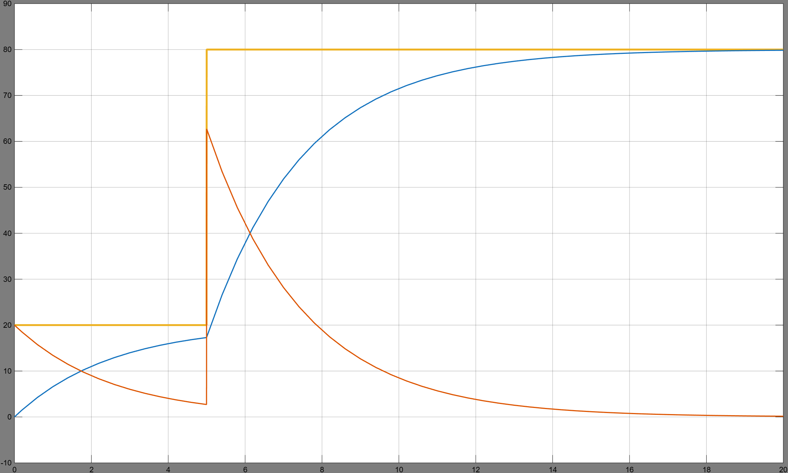

# Electric Vehicle Hybrid Energy Storage System (HESS) ⚡🏎️

Lityum-iyon bataryalar yüksek enerji yoğunluğuna sahip olsa da, ani ivmelenme (Launch) ve rejeneratif frenleme (Regeneration) sırasındaki yüksek akım (C-rate) dalgalanmalarına karşı termal ve kimyasal olarak zayıftır. 

Bu projede, elektrikli araçlarda batarya ömrünü maksimize etmek amacıyla **Batarya + Süperkapasitör Hibrit Enerji Depolama Sistemi (HESS)** tasarlanmıştır. Sistem, MATLAB/Simulink ortamında modellenmiş olup, kontrol algoritması olarak Alçak Geçiren Filtre (LPF) tabanlı **Frekans Bölüşümü (Frequency Decoupling)** stratejisi kullanılmıştır. 

Matematiksel model ve simülasyon sonuçları, bataryanın yalnızca düşük frekanslı (pürüzsüz) seyir yüklerini üstlendiğini, milisaniyelik yüksek frekanslı güç şoklarının ise (grafikteki kırmızı hat) süperkapasitör tarafından başarıyla sönümlendiğini kanıtlamaktadır. Projede sistemin diferansiyel altyapısını çözen orijinal MATLAB kodu (`.m`) ve Simulink blok diyagramı (`.slx`) bir arada sunulmuştur.

---

While Lithium-ion batteries possess high energy density, they are highly vulnerable to high C-rate current transients during rapid acceleration and regenerative braking, leading to thermal degradation and reduced cycle life.

This project introduces a **Battery + Supercapacitor Hybrid Energy Storage System (HESS)** designed to maximize battery lifespan in Electric Vehicles (EVs). Developed in MATLAB/Simulink, the control architecture utilizes a Low-Pass Filter (LPF) based **Frequency Decoupling** strategy.

The mathematical models and simulation results prove that the main battery is completely shielded from abrupt power spikes, handling only low-frequency steady-state loads. Meanwhile, the high-frequency transient shocks (red line in the graph) are instantaneously absorbed by the supercapacitor. The repository includes both the original MATLAB script solving the system's differential equations and the full Simulink block diagram.

## Power Split Dynamics under Transient Load
*(Yellow: Total Power Demand | Blue: Battery (Low-Frequency) | Red: Supercapacitor (High-Frequency))*

